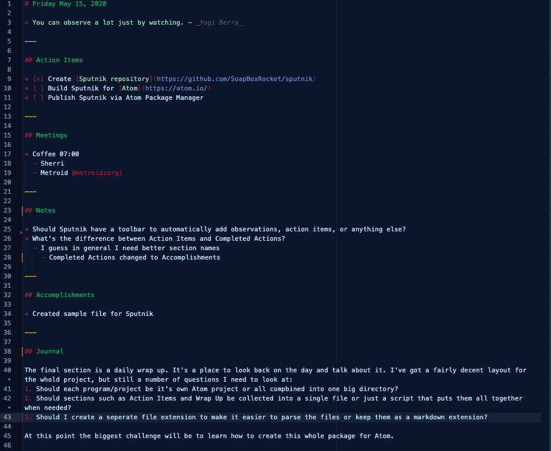

# Sputnik
## A daily log for use in the workplace.

The goal of this package is to create a daily log at work to capture the following:
* Action Items
* Meetings
* Notes
* Accomplishments
* Journal

Then larger collections can be built of any of the sections. For example you could pull all the daily journal entries for a given month or year to review. Super useful is to pull all accomplisments of the last year for your yearly review. Or the ability to search all daily notes to look for an idea you had in the past that could be useful today.

